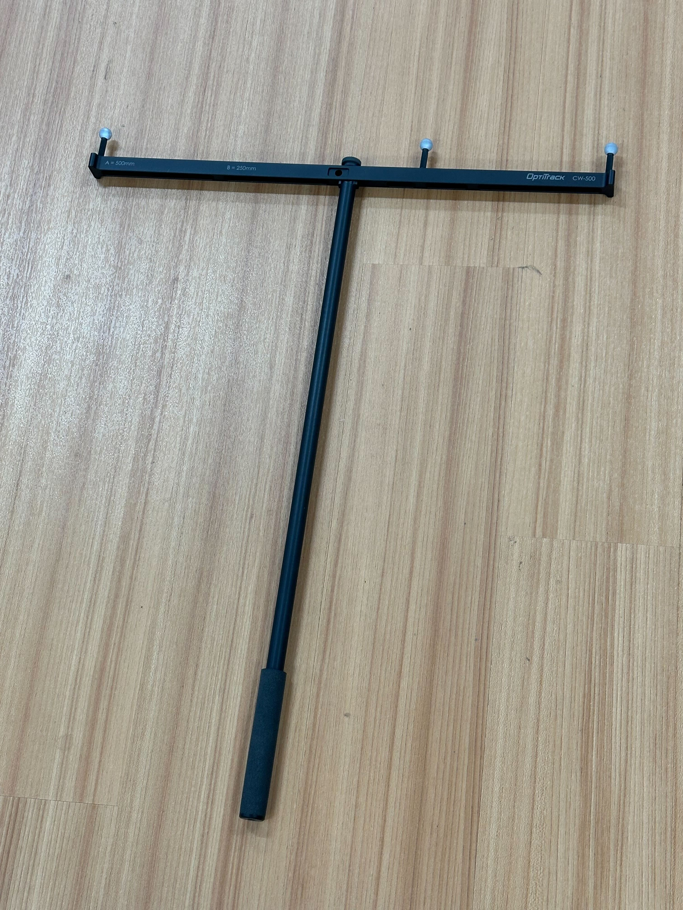
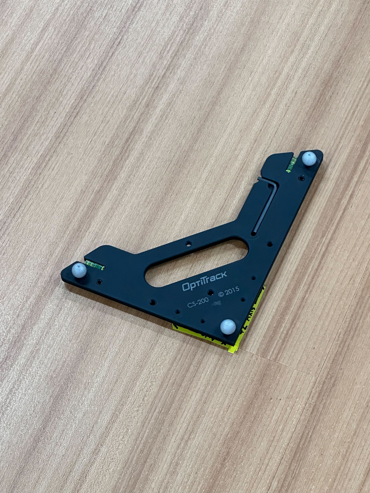

If a camera goes down or is replaced, the system must be recalibrated.

## Steps

1. **Remove all robots with markers from the camera field of view**  
   - Place the robots in a locker or cover them to avoid interference.

2. **Set the OptiTrack reference**
	{ align="center" width="50%" }
	{ align="center" width="50%" }
	- Obtain the **wand** and the **OptiTrack calibration square**.
	
	- Place the OptiTrack at the lab coordinate origin.
	- Align the square so its axes match the lab coordinate axes.
   
3. **Start wanding**
   - Launch **Motive**.
   - Click **Start Wanding**.
   - Move the wand throughout the lab so that all cameras collect samples. You will see the ring around each camera turn green as it gathers sufficiently many samples

4. **Calculate calibration**
   - Continue wanding until each camera collects **several thousand samples**.
   - Click **Calculate**.

5. **Apply calibration**
   - Click **Apply Result**.
   - Save the **calibration file**.

6. **Set ground plane**
   - Click **Set Ground Plane** to finalize the coordinate frame.