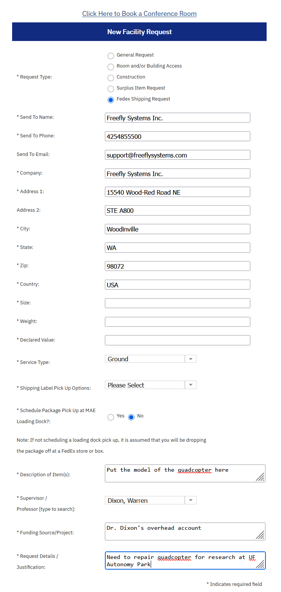

## Freefly Service Request

Begin by submitting a service request on [Freefly's website](https://freeflysystems.com/service-request). In "User Details," put "University of Florida Mechanical & Aerospace Engineering Department" down in the "Company" field.

For "Point of Purchase," select "Other." Find the purchase date for the drone in question on the original invoices. These are located in the Google Drive, under the folder `Freefly Systems`. Upload the appropriate invoice. 

Serial numbers for each drone are located on the `Decals and Serial Numbers` Google Sheet in the base folder of the Drive. 

This is the most important step. Navigate to the [Auterion Suite]() and login. Select `Fleet Management` and then `Vehicles`. Select the drone that crashed/was damaged. Click the `Settings` gear, and then click `Allow Transfer`. 

DO NOT FORGET TO INCLUDE THE ASSOCIATED REMOTE WITH THE DRONE SHIPMENT. 

## myMAE Shipping Request
Navigate to [myMAE](mymae.ufl.edu). Click `Facilities` and then `New Request`. Fill out the form as follows:

{ align="center" width="50%" }

If you are shipping the Astro, use the Pelican case. If shipping the Alta, use the foam we have and find an appropriately sized cardboard box. DO NOT THROW THIS FOAM AWAY! If Alta, you will also have to ship the Taranis remote separately, and it has its own case. This will require its own myMAE shipping form. 

NOTE: IF Astro, put: `Size: 2.5 ft x 4 ft x 3 ft` `Weight: 55 lbs`, and `Declared Value: 2500.00`. If Alta, put: `Size: 30 in x 30 in x 20.18 in` `Weight: 55 lbs`, and `Declared Value: 28500.00`. If Alta remote, put put: `Size: 12 in x 12 in x 5 in` `Weight: 10 lbs`, and `Declared Value: 200.00`.
