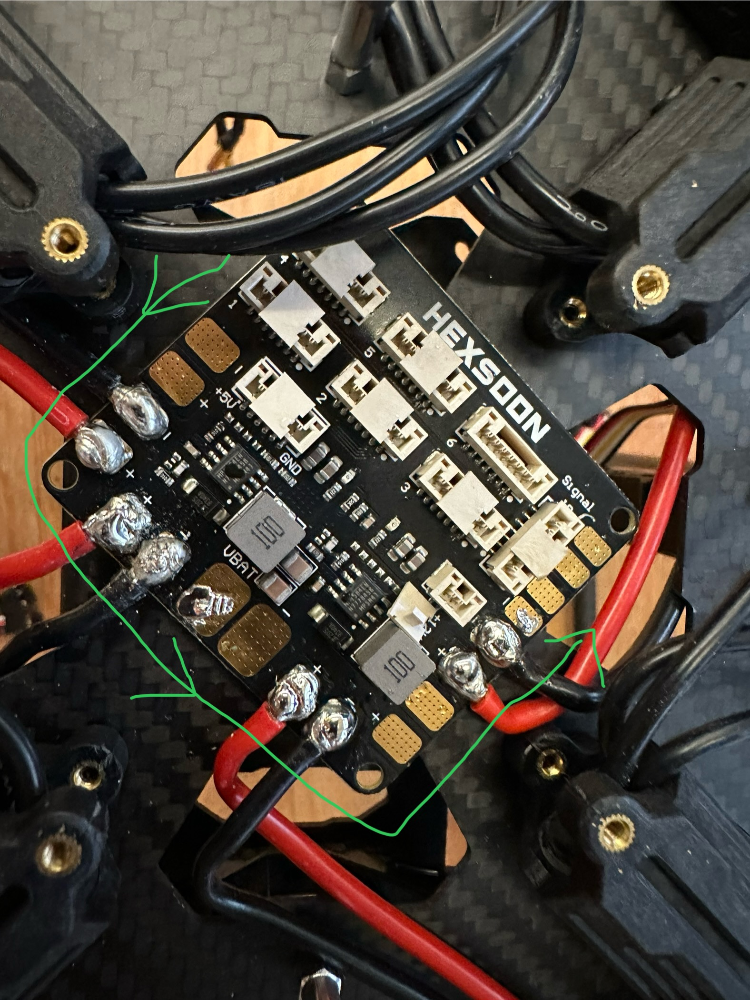

## Mounting the Power Distribution Board and Soldering ESC Wires

### Step 1: Mount the PDB
- Place the PDB on the frame using double-sided tape.
- Use alcohol to clean the contact surfaces first.
- Make sure it faces the correct direction as shown, the "front" is marked by the tape in circle

> **Important:** Use a **flat head soldering iron**.

### Step 2: Wiring the ESCs
- We need to use 8 pads on the PDB for 4 ESCs.
- Follow the scheme below in **counter-clockwise (CCW)** order.   

(The complete diagram is below)  

- Depending on the specific pad, you may need to **pre-bend the ESC wire** so it reaches the pad without excess movement.

---

### Step 3: Soldering Procedure
To get a solid connection, follow these steps:

Clean the soldering iron tip using brass wool. Apply a **tiny bit** of flux if the brass wool doesn’t clean it fully.

**Tin the pad**:  
   - Touch the pad with the iron tip and feed in a small amount of solder.  
   - Hold the tip in place for ~10 seconds until the solder melts.  
   - Tilt the iron and use the **slanted surface** to spread the solder and cover the pad.  

   > ⚠️ **Caution:** If pads are not in CCW order, there may not be enough space to lay the iron and use its slanted side.

**Place the ESC wire**:  
   - Use tweezers to hold the wire tip on the pad.  
   - Press the iron tip against it until the solder on the wire and pad both melt.  
   - If they don’t melt, apply a tiny bit of flux.  

**Bond the wire**:  
   - Hold the wire in place and lift the iron.  
   - The wire should stay put as the solder cools.  

**Reinforce the joint**:  
   - Press the slanted surface of the iron onto the wire again.  
   - Feed in more solder to fully cover the wire.  
   - Be careful to **avoid solder bridges** to other pads or wires.  

**Cool and check**:  
   - Lift the iron and keep holding the wire with tweezers until the solder cools.  
   - A good joint will have a **smooth and shiny surface**.  

**Test the connection**:  
   - Gently **tug the wire** to confirm it's solidly bonded.  

**Repeat** for the next pad.  

If a connection fails:  
   - Clean any flux residue on that pad and try again.  
   - It’s **completely normal** to not succeed on the first attempt.  
