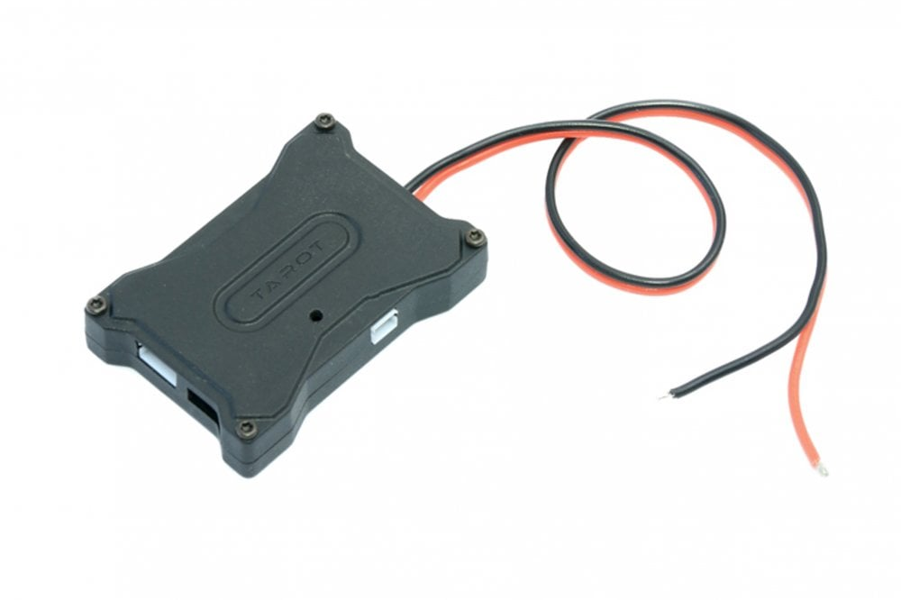
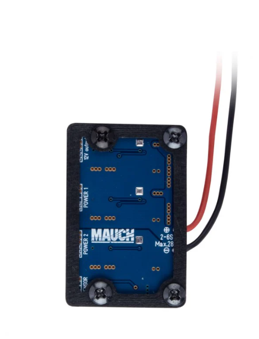
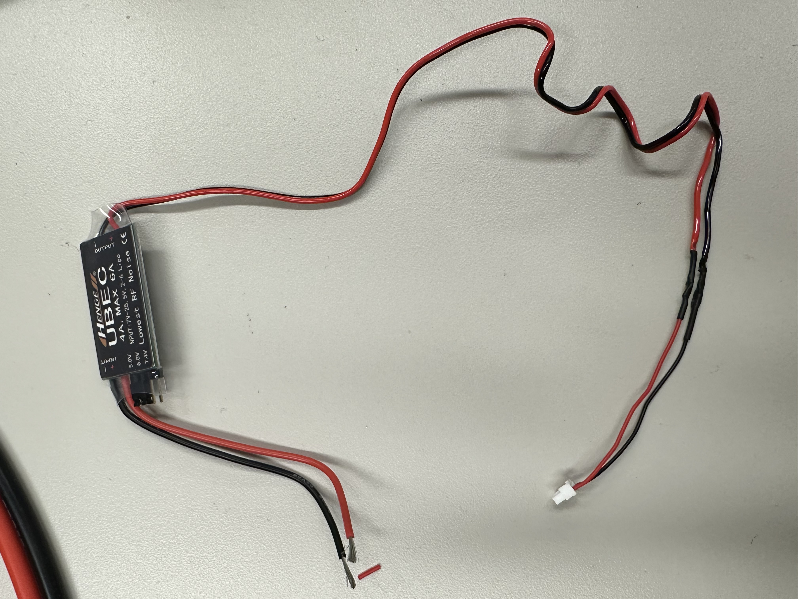
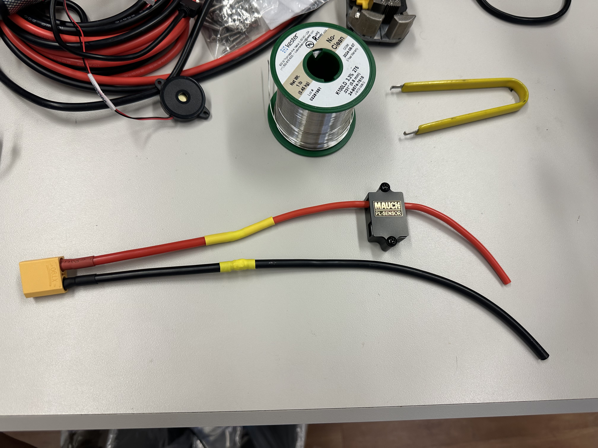
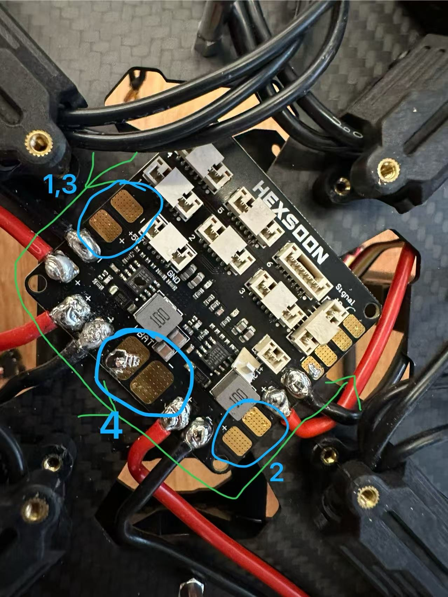
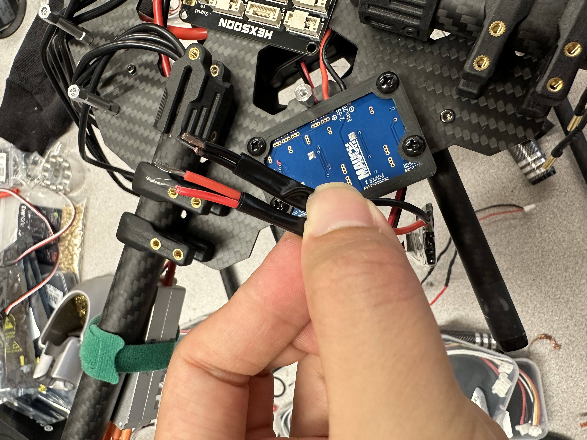

Now that we have soldered all four ESCs to the board, there are still a few additional components that need to be soldered.

## Components to Solder

1. **Landing Gear Wire**  
   

2. **MAUCH Battery Eliminate Circuit (BEC)**  
   

3. **Universal BEC**  
   

4. **Battery Connector**  
   

## Solder Pads

The picture below shows the pads on the board where these components will be soldered.  

## Important Note

Components **1** and **3** will be soldered to the same pad. It is recommended to twist the exposed wires together and tape the insulation before soldering, as shown below.  

