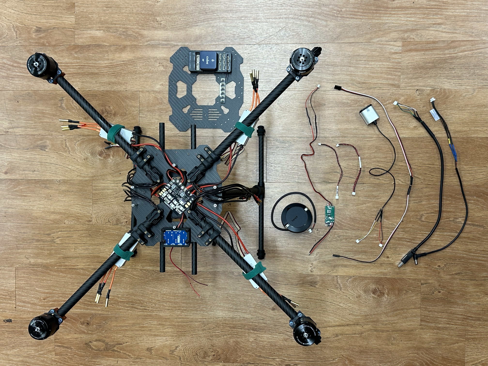

# Accessory wires overview

There's a number of accessory wires needed for the drone, some can be used out of the box(OB) and the other need modifications. The picture below shows all the modified wires and a few OB wires, use the hyperlink for detailed mod instruction.

{ align="center" width="50%" }

From top to bottom, the wires are:  
  ## GPS Connector (OB)
  ## [CAN bus power](https://www.youtube.com/watch?v=dQw4w9WgXcQ)
  ## [PX4 to CAN](https://www.youtube.com/watch?v=dQw4w9WgXcQ) (short wire)
  ## Optic flow (OB)
  ## [Lidar](https://www.youtube.com/watch?v=dQw4w9WgXcQ)
  ## [Landing gears](https://www.youtube.com/watch?v=dQw4w9WgXcQ)
  ## [FTDI to USB](https://www.youtube.com/watch?v=dQw4w9WgXcQ)
  ## [Jetson Power](https://www.youtube.com/watch?v=dQw4w9WgXcQ)

Other OB wires are: