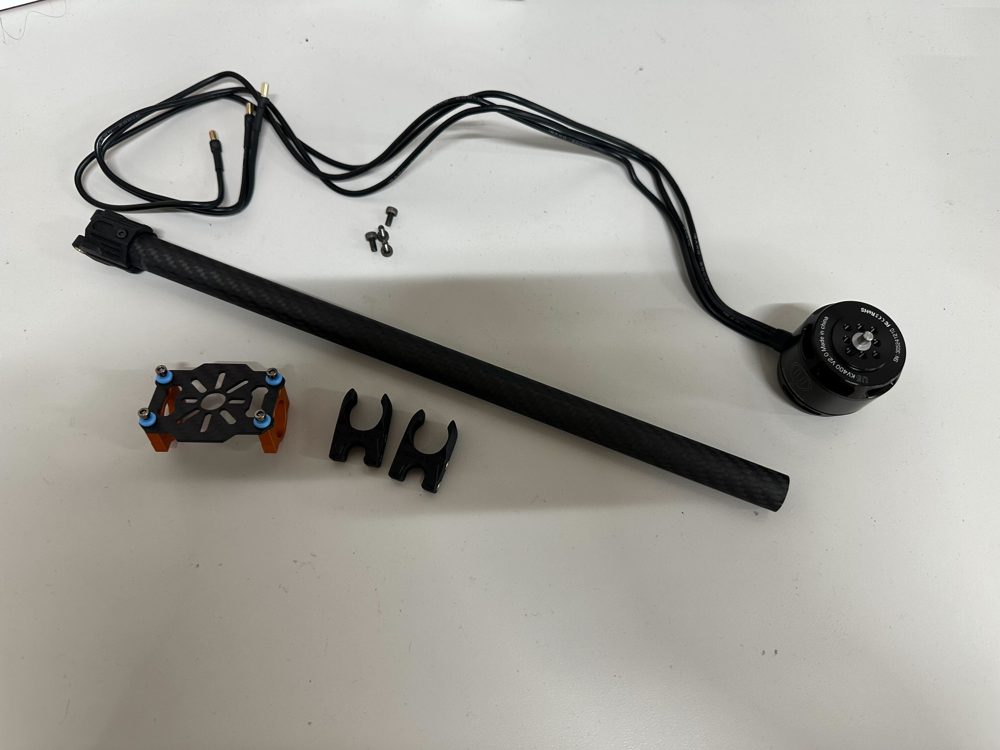
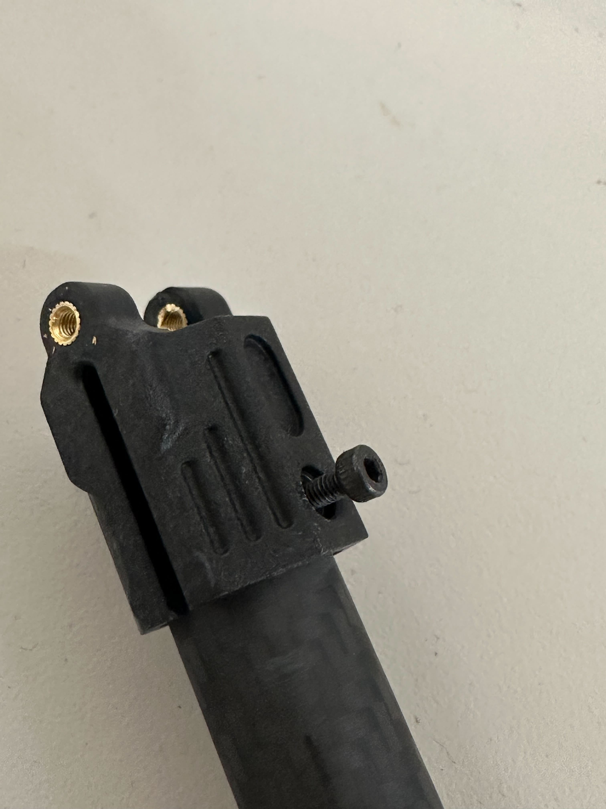
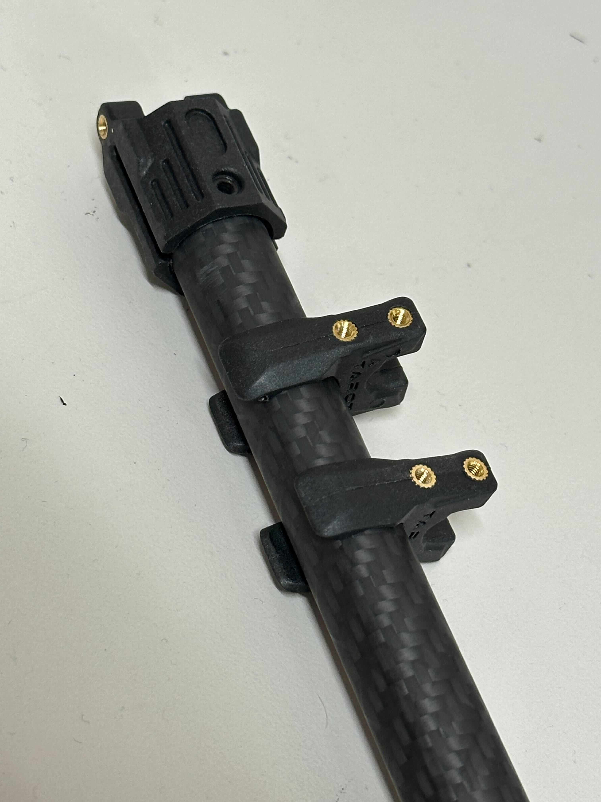
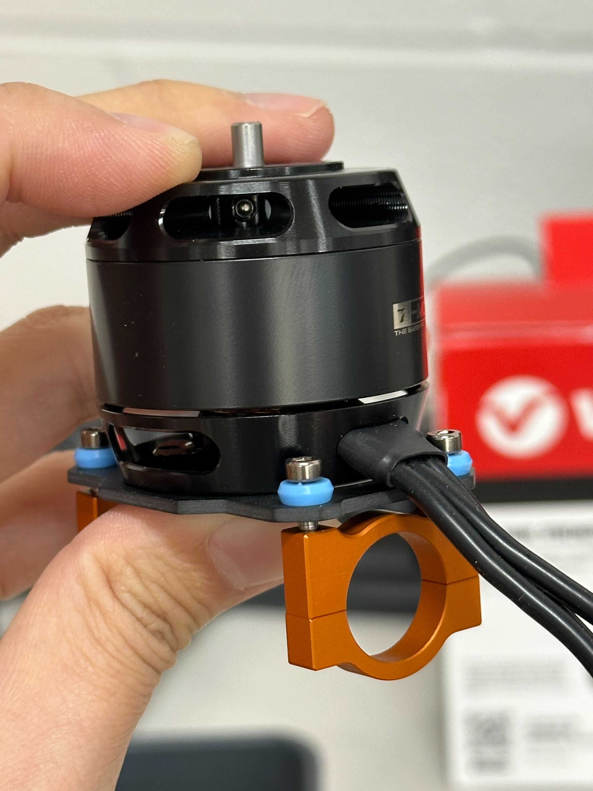
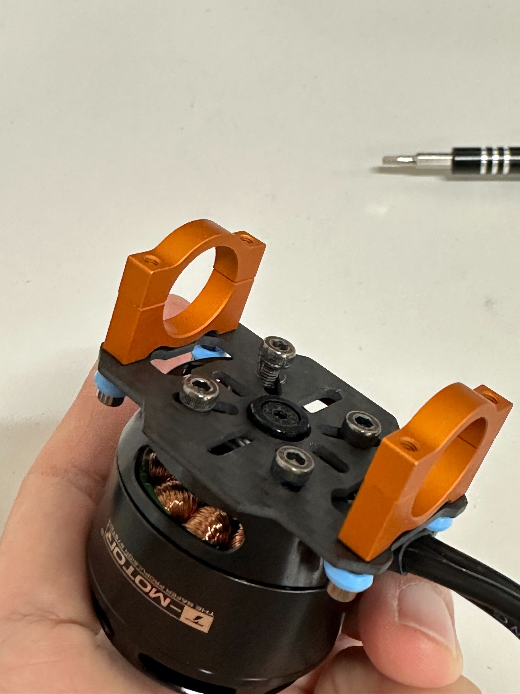
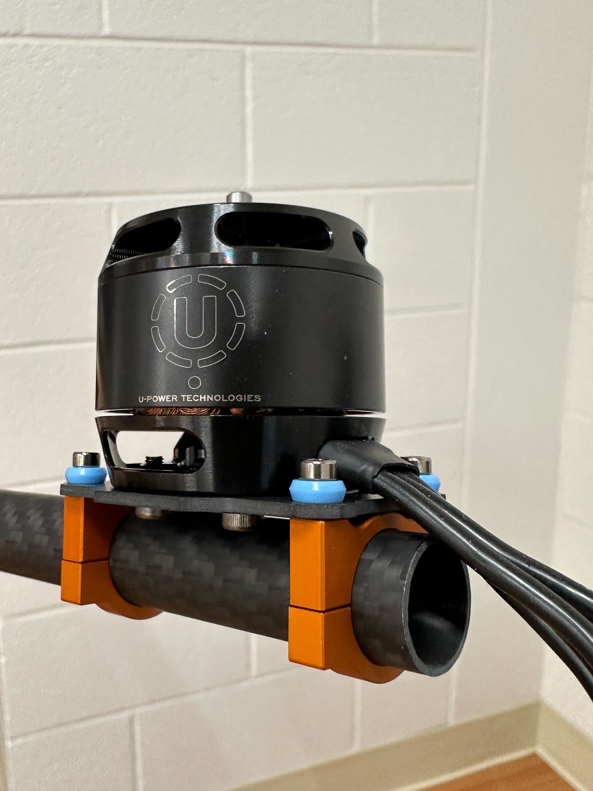
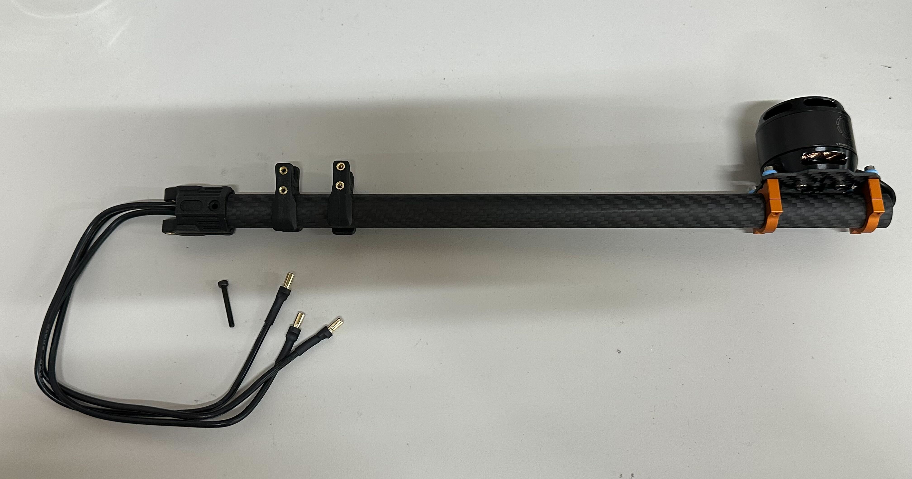

# Arm–Motor Subassembly Instructions

## Required Tools
- 2 mm hex screwdriver  
- 2.5 mm hex screwdriver  

---

## Overview
Each arm consists of the components shown below.

---

## Assembly Steps

### Step 1  
Remove the **2 mm horizontal screw** that goes through the arm tube.  

---

### Step 2  
Slide in the plastic brackets that will mount the arm to the body plates later.  

---

### Step 3  
Place the motor on the motor mount and use **four (4) 2.5 mm shoulder screws** to fasten them.  
Install all four screws before tightening them.  

---

### Step 4  
Slide the motor mount onto the arm tube with the motor cable facing outward.  

---

### Step 5  
Tuck the cables into the arm and push them through to the other end.  
Place the horizontal screw back in position.  

