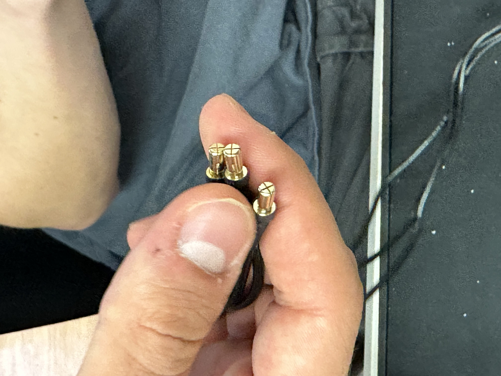

# Drone Building Documentation

## Reason?(add later)

## Components Breakdown of our drones (add later)

## Steps to replace connectors on the motor

- All 3 cables on the motor should be male connectors
- Cut the orginal connectors and solder the new ones # pictures of connectors
- use helping hands
- Tin the tip before start
- Safety is important, lead-free solder is used but we treat it as leaded, so clean hands when done with work
- Keep the fan on
- Flux: a chemical compound used to clean metal surfaces before soldering. It removes oxides and other impurities, which helps the solder adhere to the metal and form a strong join
- Solder temperature is $400^oC/750^oF$
- Rubber heat shrink when connectors are soldered properly

