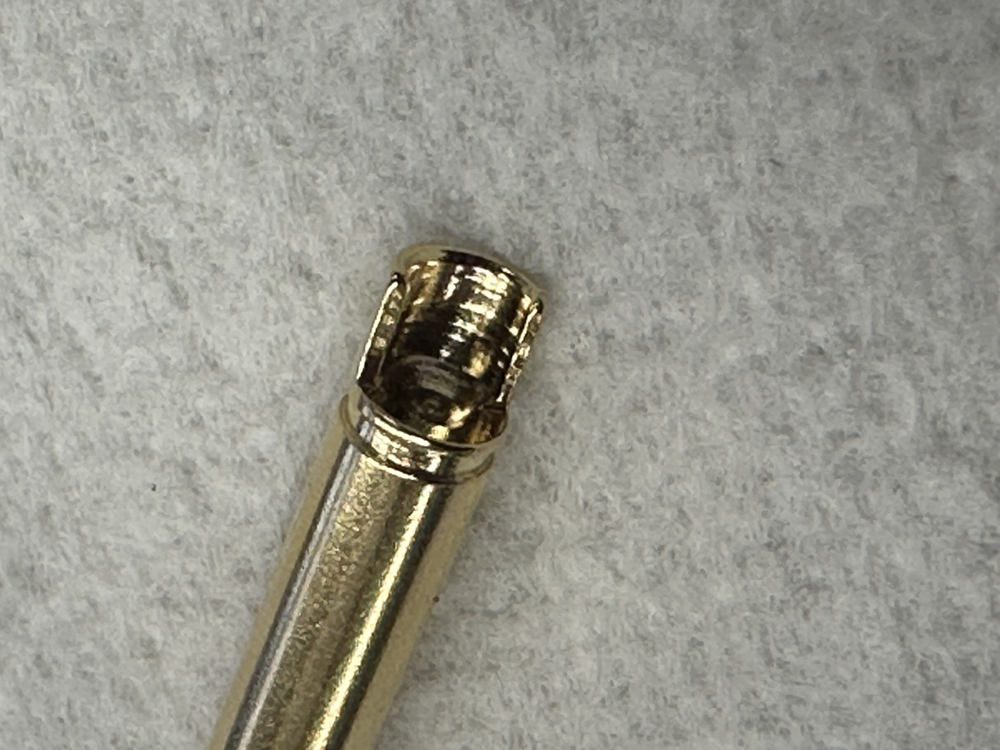
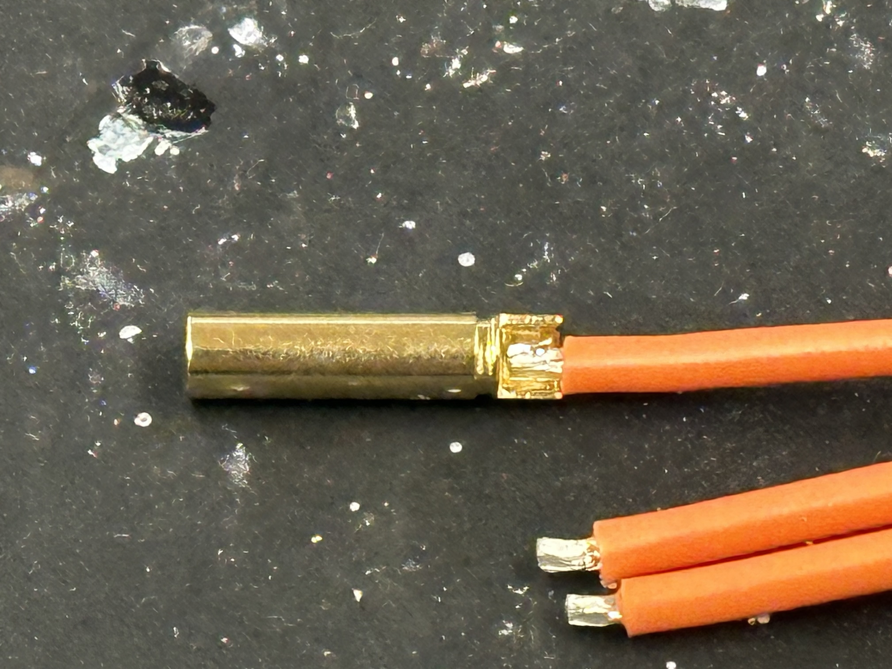
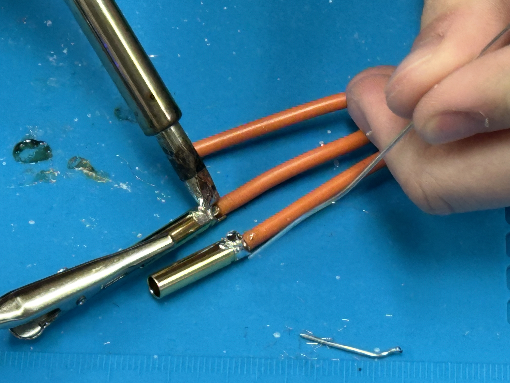
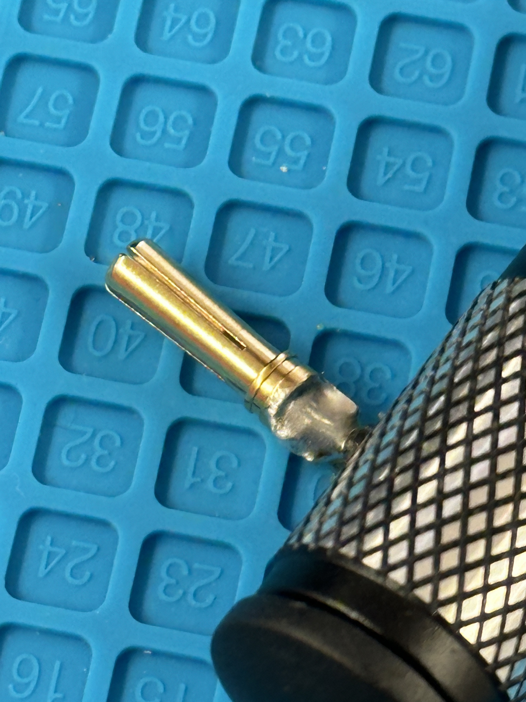
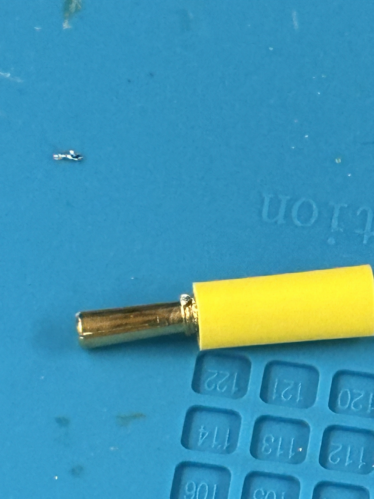

# Electronic Speed Controller (ESC) Soldering Guide

The steps are similar to motor soldering, but **we are using female connectors instead**.

## Prepare the ESC and Wires

First, take the ESC out of the box. Be careful to **not remove the insulation** from the wires unless re-soldering is absolutely necessary.

!!! warning "Handle with Care"
    The wires are short—try to get it right on the first attempt.

{ align="center" width="50%" }

## Prepare the Connector

Grab a **female connector** and place both it and the wire on a soldering mat, noting that the **female connector's end is different** from the male version. Align the wire tip inside the connector cup so the insulation meets the end of the connector, then use heavy objects to secure both the wire and the connector in place.

{ align="center" width="50%" }
{ align="center" width="50%" }

## Prepare the Soldering Iron

To prepare for soldering, turn on the **fume extractor** or a fan. Set your soldering iron to **400°C (750°F)**, then clean the tip and **tin it** by applying a small amount of fresh solder.

## Solder the Wire to the Connector

!!! danger "Burn Hazard"
    Avoid touching the hot end of the connector with the iron.

Press the hot iron to the joint where the wire and connector meet. Touch the solder directly to this heated joint—it should melt immediately and flow into the cup. Continue to feed solder into the joint until it fully covers the wire and fills any gaps.

!!! warning "Ensure a Proper Joint"
    Avoid soldering the outer surface of the connector; the solder should flow into the cup.

{ align="center" width="50%" }

## Check and Secure the Solder Joint

Once the joint is filled, remove the iron and allow the solder to cool naturally. If the result is unsatisfactory, you can reheat the joint and add more solder. After it has cooled, use pliers to gently pull the connector to verify it is firmly attached.

{ align="center" width="50%" }

## Apply Heat Shrink Tubing

Slide a correctly sized piece of heat shrink tubing over the finished joint, positioning it to completely cover the connector’s circular bulge. Use a heat gun to shrink the tubing until it is snug and secure.

{ align="center" width="50%" }
{ align="center" width="50%" }

## Repeat for Remaining Connectors

Repeat these steps for the remaining **three ESC wires**. Once complete, inspect all your solder joints to ensure they are high quality and consistent.

## Commission the ESC

Once all connectors are soldered and secured, the ESC is ready for commissioning.

{ align="center" width="50%" }

## Clean Up

To clean up, turn off the soldering iron, heat gun, and fume extractor. Properly dispose of any leftover wire clippings and other waste materials.

!!! danger "Safety First: Lead Contamination"
    Although modern solder is often lead-free, it's best practice to treat it as if it contains lead. 🧼 **Wash your hands thoroughly with soap and water.**