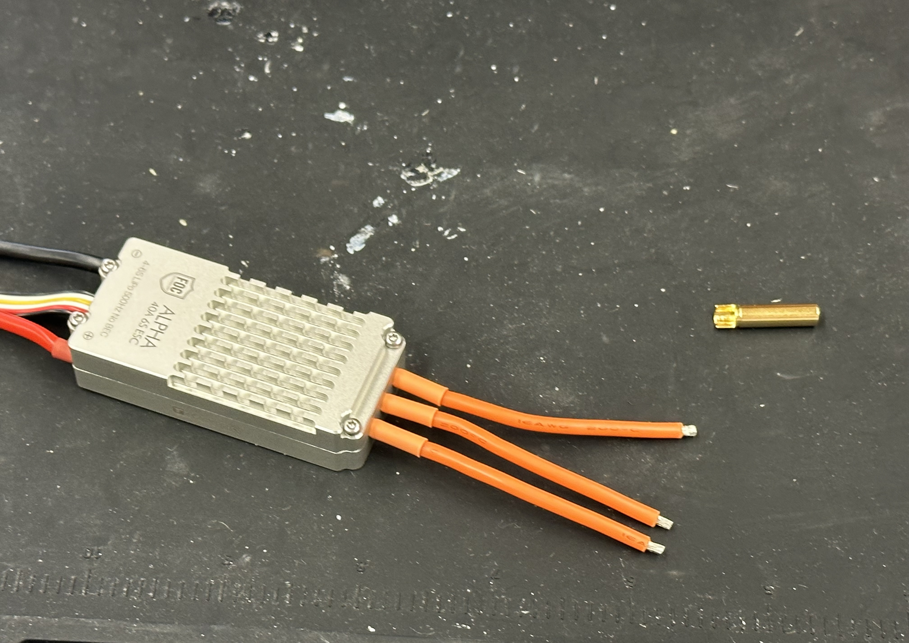
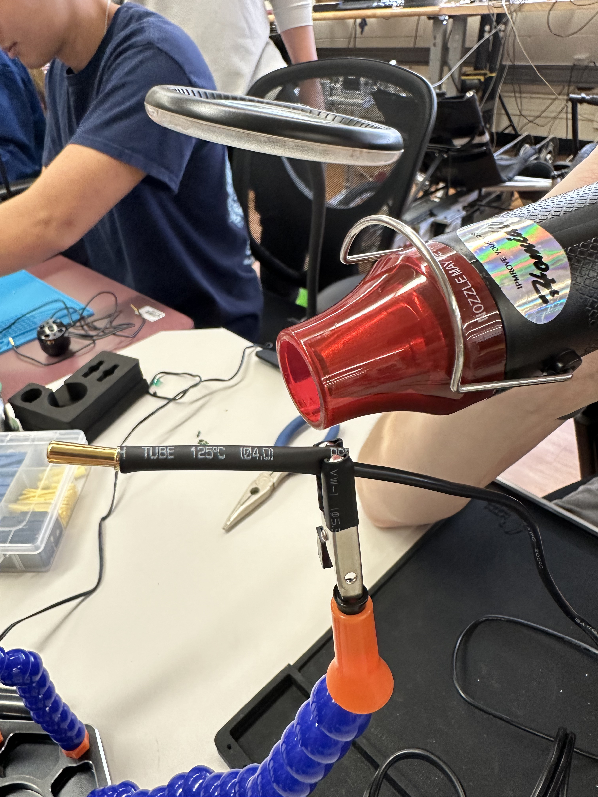
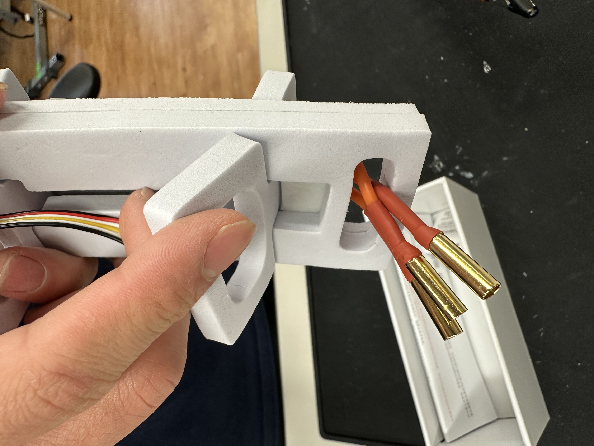

# Electronic Speed Controller (ESC) Soldering Guide

## The steps are basically the same as the motors, but we are soldering female connectors instead

1. **Prepare the ESC and Wires**  
     Take the ESC out of the box.  
     Don't remove extra insulation from the wire unless you have to re-solder  
     **Caution:** Try to succeeed at once due to cables being significantly shorter  
        

2. **Prepare the Connector**  
     Grab a female connector and place both the wire and connector on a soldering mat.  
     Notice that female connector's end is different  
     
     Align the tip of the wire inside the connector so that the remaining insulation meets the end of the connector.
    
     Secure the wire and connector by using a heavy object to press down on the wire and another object to hold the connector in place.

3. **Prepare the Soldering Iron**  
     Turn on the fume extractor/fan and your solder iron  
     Set the soldering iron to **400°C (750°F)**.  
     Clean the tip of the soldering iron and apply solder around it to tin the tip (*important*).

4. **Solder the Wire to the Connector**  
     Press the iron at the point where the wire and connector meet.  
     **Caution:** The iron should never touch the connector's end.  
     Press the solder against the iron—it should melt immediately.  
     Gently push the solder toward the iron to feed it into the joint.  
     Continue feeding until there is enough molten solder to fully cover the wire and any gaps. 
      
     **Caution:** Avoid getting solder on the outer surface of the connector.

5. **Check and Secure the Solder Joint**  
     Lift the soldering iron and allow the solder to cool.  
     If the result is unsatisfactory, repeat steps 5-6 to reshape or add more solder.  
     Once properly soldered, let it cool and use pliers to grab the connector end and gently pull to test its strength.
     

6. **Apply Heat Shrink Tubing**  
     Slide a heat shrink tube of proper diameter and length onto the connector.  
     Pull it down to cover the circular bulge on the connector.  
      
     Use a heat gun to shrink the tubing until it fully adheres to the joint.  
       

7. **Repeat for Remaining Connectors**  
     Repeat steps 2-6 for all three connectors.  
     Inspect the solder joints to ensure quality.  

8. **Commission the ESC**  
     Once all connectors are properly soldered and secured, the ESC is ready for commissioning.  
     See below  
     

9. **Clean up**  
   Turn off devices  
   Dispose of all the litter  
   We use lead-free solder but we treat it as leaded, so don't forget to wash hands

