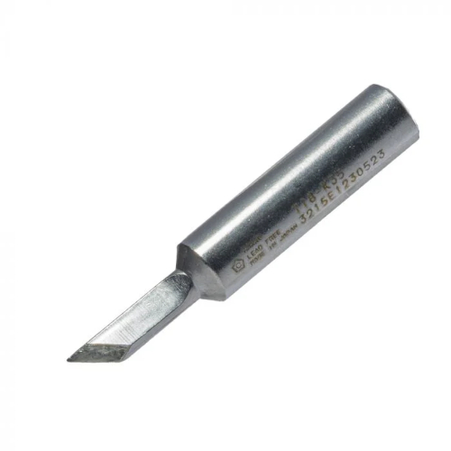
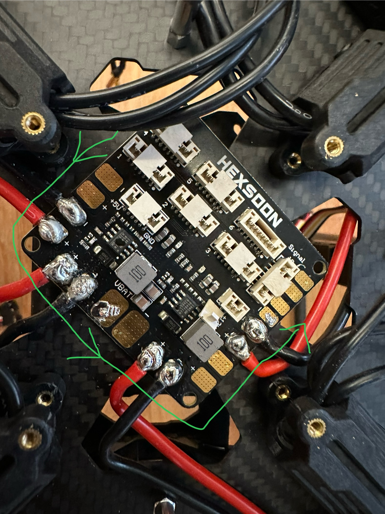

## Mounting the Power Distribution Board and Soldering ESC Wires

### Mount the PDB

First, clean the contact surfaces on the frame with alcohol. Once dry, place the PDB on the frame using double-sided tape. Make sure the board faces the correct direction as shown in the image; the "front" is marked by the circled tape.

{ align="center" width="60%" }

!!! tip "Pro Tip"
    Use a **knife head soldering iron** for better surface contact on the pads.  
{ align="center" width="60%" }  
    Heat the iron to **850 F** for better heat transfer

### Wire the ESCs

You will use eight pads on the PDB to connect the four ESCs. It is crucial to solder the wires in a **counter-clockwise (CCW)** order, following the scheme shown in the images below. Depending on the location of the pad, you may need to **pre-bend the ESC wire** so it reaches without excess slack or tension.

{ align="center" width="50%" }

<a href="/images/homebrew/cubepilot-diagram.jpg" target="_blank">
  
CubePilot Wiring Diagram

</a>

### Follow the Soldering Procedure

Follow these steps carefully to ensure a solid and reliable connection. First, clean the soldering iron tip using brass wool. Apply a **tiny bit** of flux only if the brass wool doesn't clean it fully.

**To tin the pad**, touch it with the iron tip and feed in a small amount of solder. Then, tilt the iron to use its **slanted surface** to spread the solder and completely cover the pad.

!!! warning "Check Soldering Order"
    If pads are not soldered in a counter-clockwise order, there may not be enough physical space to lay the iron flat and use its slanted side effectively on later pads.

**To place the ESC wire**, use tweezers to hold the wire tip on the tinned pad. Press the iron tip against the wire until the solder on both the wire and the pad melts together. If they don't melt easily, apply a tiny bit of flux to aid the process.

**To reinforce the joint**, keep pressing the iron onto the bonded wire and feed in more solder to fully cover it. Be careful to **avoid creating solder bridges** to adjacent pads or wires.

**To cool and check the joint**, lift the iron and continue holding the wire with tweezers until the solder is completely cool. A good joint will have a **smooth and shiny surface**.

**Finally, test the connection** by gently **tugging the wire** with tweezers to confirm it is solidly bonded.

Repeat this process for all remaining pads. If a connection fails, clean any flux residue from the pad and try again. It’s **completely normal** to not get a perfect joint on the first attempt, so take your time.