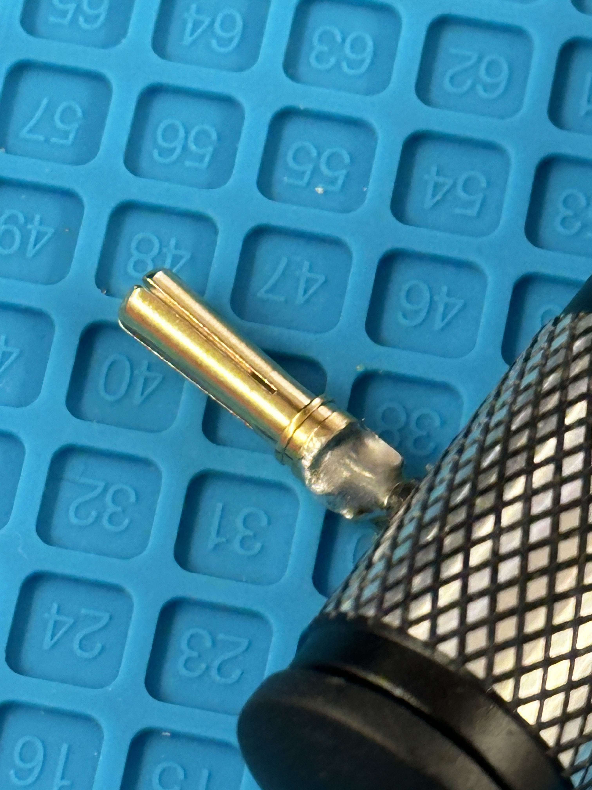

# Motor Soldering Guide

Guide for soldering **male connectors** to motor wires.

---

### 1. Prepare the Motor and Wires

- Take the motor out of the box.
- Use wire cutters to remove the original connectors.

{ width="300" }

---

### 2. Strip the Wire Insulation

- Use a wire stripper to remove about **3mm** of insulation.

{ width="300" }

- Twist the exposed wire so no strands are loose.

{ width="300" }

---

### 3. Prepare the Connector

- Grab a **male connector**.
- Place the wire and connector on a soldering mat.
- Align the tip of the wire so the insulation meets the connector’s end.

Notice the cone-shaped tip in the image below.

{ width="300" }

- Use a heavy object to press down on the wire and another to secure the connector.

---

### 4. Prepare the Soldering Iron

- Turn on the **fume extractor/fan** and your soldering iron.
- Set the iron to **400°C (750°F)**.
- Clean and **tin the tip** by applying solder before use.

---

### 5. Solder the Wire to the Connector

- Press the iron where the wire and connector meet.  
!!! warning
     Do not touch the connector’s tip directly — the one below is scrapped.

{ width="300" }

- Touch the solder to the iron—it should melt instantly.
- Feed solder into the joint until the wire is fully covered and gaps are filled.

{ width="300" }

!!! warning
     Avoid soldering the outside surface of the connector.

---

### 6. Check and Secure the Solder Joint

- Lift the iron and let the solder cool.
- If needed, reheat to adjust or add more solder.
- Once cooled, test the joint’s strength by gently pulling with pliers.

{ width="300" }

---

### 7. Apply Heat Shrink Tubing

- Slide a properly sized **heat shrink tube** over the connector.
- Position it to cover the bulge.

{ width="300" }

- Use a heat gun to shrink the tubing snugly.

{ width="300" }

---

### 8. Repeat for Remaining Connectors

- Repeat steps **2–7** for all **three motor wires**.
- Inspect all solder joints for consistency and quality.

---

### 9. Commission the Motor

- Once all connectors are properly soldered and insulated, the motor is ready for use.

{ width="300" }

---

### 10. Clean Up

- Turn off all tools and equipment.
- Dispose of any leftover material or trash.
- We use **lead-free solder**, but treat it like leaded:
  🧼 **Wash your hands thoroughly.**
