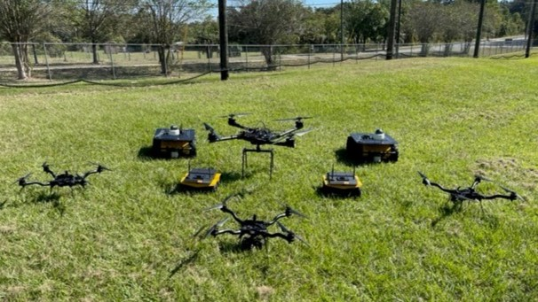

# Welcome to the Autonomy Park!

## HAVE YOU DONE THE ROS 2 TUTORIALS YET?

<a href="https://docs.ros.org/en/humble/Tutorials.html" target="_blank">Get on it, soldier</a>



<a href="https://join.slack.com/t/autonomypark/shared_invite/zt-2monroejk-Kf5l7pKnbAFfJVt4eI9R_A" target="_blank">Join the Autonomy Park Slack Group</a>

## super-client-config.yml

I know you forgot this somewhere

```
<?xml version="1.0" encoding="UTF-8" ?>
<dds>
    <profiles xmlns="http://www.eprosima.com/XMLSchemas/fastRTPS_Profiles">
        <participant profile_name="super_client_profile" is_default_profile="true">
            <rtps>
                <builtin>
                    <discovery_config>
                        <discoveryProtocol>SUPER_CLIENT</discoveryProtocol>
                        <discoveryServersList>
                            <RemoteServer prefix="44.53.00.5f.45.50.52.4f.53.49.4d.41">
                                <metatrafficUnicastLocatorList>
                                    <locator>
                                        <udpv4>
                                            <address>192.168.1.201</address>
                                            <port>11811</port>
                                        </udpv4>
                                    </locator>
                                </metatrafficUnicastLocatorList>
                            </RemoteServer>
                        </discoveryServersList>
                    </discovery_config>
                </builtin>
            </rtps>
        </participant>
    </profiles>
</dds>
```

## Add to .bashrc

```
source /opt/ros/humble/setup.sh
export ROS_DOMAIN_ID=0
export ROS_DISCOVERY_SERVER="192.168.1.201:11811"
export FASTRTPS_DEFAULT_PROFILES_FILE=~/super_client_config.xml
```
