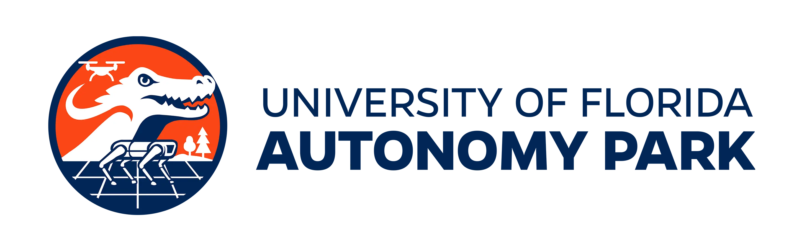
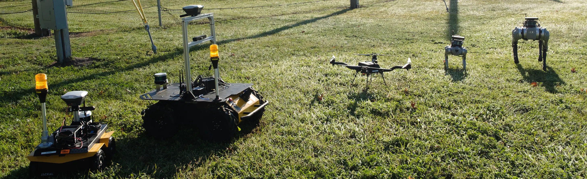

  
   
  

##  Ongoing work/to-do lists

### Air Team
- Flight testing to certify remaning Homebrews
- CBF safety for indoor and outdoot robots
- RTK GPS for PX4
- Docker container for Zed and MAVROS

### Ground Team
- Jetson control board swap
- Docker integration for dogs
- Print backpacks 
