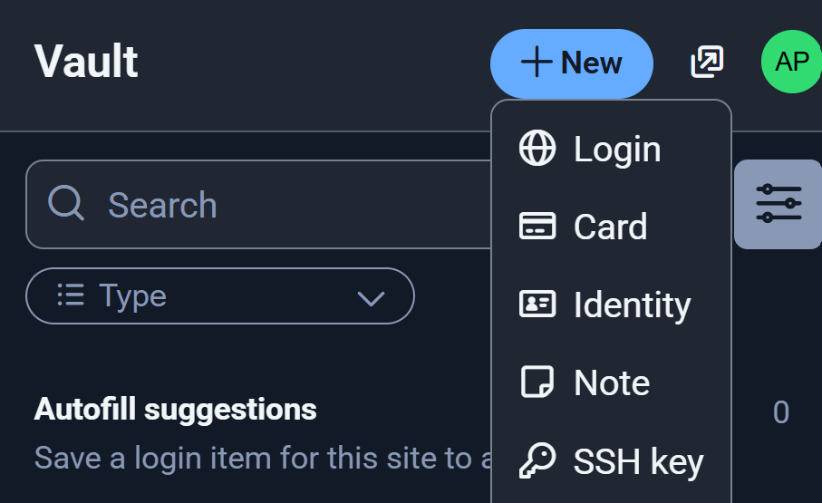
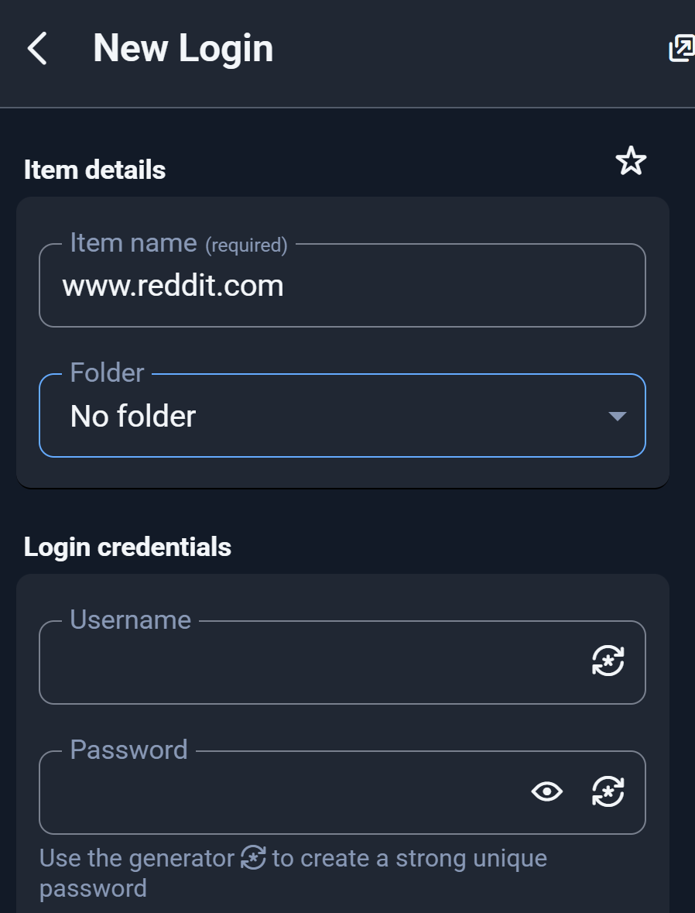

## Chrome
All of the Autonomy Park bookmarks and accounts are saved in our Google Chrome profile. Log in using the Autonomy Park email and password (ask an admin). Use Chrome on all Autonomy Park computers to keep things consistent. 

## Bitwarden
Do not use the default Autonomy Park password for any user account. Generate a strong password and save it to [Bitwarden](https://bitwarden.com/). This is installed as an extension in our Chrome profile. To save a new login, do the following:

Navigate to the site which you need a new login for. In this example, we'll use `reddit.com`. Open the Bitwarden extension. Click the `+New` button and then the `Login` button.

{ align="center" width="10%" }

{ align="center" width="50%" }

Fill in the `username` field and click the `generator` button in the `password` field to create a strong unique password.

{ align="center" width="50%" }

COPY THE PASSWORD TO YOUR CLIPBOARD. Click `Use this password`. Then, click `Save`. That's it!   

## Raindrop